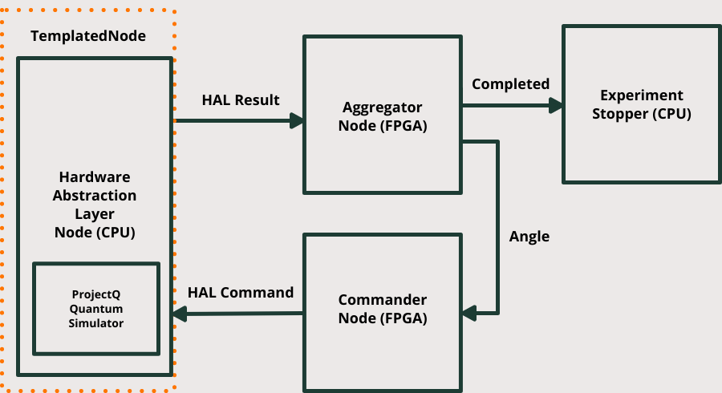

# Deltaflow-on-ARTIQ

[Deltaflow-on-ARTIQ repo](https://github.com/riverlane/deltaflow-on-artiq) -
[](http://jenkins-riverlane.northeurope.cloudapp.azure.com/job/deltaflow-on-artiq_multibranch_build/job/dev/) -
[docs](https://riverlane.github.io/deltaflow-on-artiq):

- [Deltalanguage repo](https://github.com/riverlane/deltalanguage) -
[](http://jenkins-riverlane.northeurope.cloudapp.azure.com/job/deltalanguage_multibranch_build/job/dev/) -
[docs](https://riverlane.github.io/deltalanguage)

- [Deltasimulator repo](https://github.com/riverlane/deltasimulator) -
[](http://jenkins-riverlane.northeurope.cloudapp.azure.com/job/deltasimulator_multibranch_build/job/dev/) - 
[docs](https://riverlane.github.io/deltasimulator)

- [Deltamodels repo](https://github.com/riverlane/deltamodels) -
[](http://jenkins-riverlane.northeurope.cloudapp.azure.com/job/deltamodels_multibranch_build/job/dev/) -
[docs](https://riverlane.github.io/deltamodels)


## Intro

ARTIQ Emulator is an [M-Labs](https://m-labs.hk) -
[ARTIQ](https://github.com/m-labs/artiq/tree/master/artiq)
emulator integrated to our Deltaflow framework.

Deltaflow let's you design heterogeneous applications in a modular fashion.
It let you squeeze the most out of your hardware using a simple language and
it gives you the flexibility needed to integrate to your existing control stack.

## Prerequisite

The `Artiq Emulator` environment has been tested on Linux and Mac. Windows is currently not supported. 
`Artiq Emulator` relies almost exclusively on Docker (Docker Desktop on MAC) to maximise portability. 
Said that, we recommend a relatively recent machine to go through the various compilation steps.

## Installing ARTIQ Emulator

As a first step you might need to init/update all the submodules.

```console
river@lane:~$ cd deltaflow-on-artiq
river@lane:~/deltaflow-on-artiq$ git submodule update --init --recursive
```

To create all the docker images you can run:

```console
river@lane:~$ cd deltaflow-on-artiq
river@lane:~/deltaflow-on-artiq$ make run-kasli-emulator
```

The creation of the docker containers currently takes about 2-3 hrs on standard machines.

## Using ARTIQ Emulator

The user can execute three primary demos (and explore loads of Jupiter notebooks):

### Deltaflow Graph  

To run the demo:
```console
river@lane:~$ cd deltaflow-on-artiq
river@lane:~/deltaflow-on-artiq$ make run-deltagraph

```

Structure of the demo:
- `deltalanguage` -> this repo contains the core language used by Deltaflow <br>
- `deltalanguage/examples/rabi_demo/` -> this folder contains the graph definition and the nodes for the graph.<br>
- - `demos/deltalanguage/Makefile` -> Make targets definitions<br>

#### Description of the graph (RABI oscillation)

We have selected a simple but powerful example of the capabilities of Deltaflow: a Rabi Oscillation (with a twist). The idea is simple: the user sends a sequence of gates (mainly rotation of variable phase over the same dimension) and operations via an Hardware Abstraction Layer and the control stack maps this requests into low-level control. To spice things up we added a low-latency feedback loop control on the angle that is generated. Measurements from the experiment drive the selection of the next sequence of rotations to be applied - all via FPGA logic. 

The graph that follows describes the experiment. An Aggregator node receives the measurement from the control stack and applies a customizable selection criteria to the input to generate the next rotation angle. Commander node takes the sequence and prepares the HAL commands to be sent to the quantum control stack. The HAL guarantees that different control stacks can be connected to the graph in an interchangeable fashion. The ReadoutGen block runs [ProjectQ](https://projectq.ch) to emulate the behaviour of the quantum system. In the next demos, this block will evolve into a full-fledged emulator that shows the timing behaviour of a real quantum control stack!
 


### Deltaflow Simulator

To run the demo:
```console
river@lane:~$ cd deltaflow-on-artiq
river@lane:~/deltaflow-on-artiq$ make run-deltaruntime

```

This demo shows the conversion of a Deltagraph (python and migen nodes) into SystemC runtime. 
Main components of the demo are: 
- `deltasimulator` -> library required for converting Deltagraph into an hardware runnable implementation<br>
- `deltalanguage/examples/rabi_demo/` -> this folder contains the graph definition and the nodes for the graph.<br>
- `demos/deltasimulator/Makefile` -> library required for converting a Deltagraph into an hardware runnable implementation (currently SystemC)<br>
- `demos/deltasimulator/main.py` -> Script that calls the build commands on the different nodes<br>
- `demos/deltasimulator/df_module.*` -> Manual (and temporary) wiring of the systemC deltanodes <br>
- `demos/deltasimulator/run_experiment.cpp` -> Manual (and temporary) of all the nodes in a top_level block <br>

Artifacts:
`rabi_test.vcd` that can be visualized with `gtkwave`

### ARTIQ Emulator + Runtime

To run the demo:
```console
river@lane:~$ cd deltaflow-on-artiq 
river@lane:~/deltaflow-on-artiq$ make run-kasli-emulator
```

This demo takes the graph generated in the previous steps and connects it to an ARTIQ emulator. A modified version of the ARTIQ firmware reads commands from the Graph and generates accesses to the RTIO. (Refer to [ARTIQ](https://github.com/m-labs/artiq/tree/master/artiq) for more information)

- `deltasimulator` -> library required for converting Deltagraph into an hardware runnable implementation<br>
- `deltalanguage/examples/rabi_demo/` -> this folder contains the graph definition and the nodes for the graph.<br>
- `deltamodels` -> this repository contains all the hardware models ([TLM](https://www.doulos.com/knowhow/systemc/tlm-20/)s and [Misoc](https://github.com/m-labs/misoc) models) used by the emulator.<br>
- `emulator/mor1kx` -> The *[or1k](https://openrisc.io/or1k.html)* (SoftCPU)<br>
- `emulator/or-tlm` -> Wrapper for the The *[or1k](https://openrisc.io/or1k.html)* (SoftCPU) SystemC<br>
- `emulator/artiq` -> Fork of the ARTIQ repository mainly for yet to be accepted `firmware` changes<br>
- `emulator/artiq_emulator.hpp` -> Contains the definition of the emulator with the wiring of the top level and the tlms<br>
- `emulator/deltaflow_emulator.cpp` -> Contains the emulator wired to the Deltaflow graph<br>
- `emulator/SoCBuilder` -> Definition via Migen/Misoc of the FPGA gateware to be simulated.<br> 
- `emulator/or1ksim-kasli.cfg` -> *[or1k](https://openrisc.io/or1k.html)*. configuration file<br>
- `emulator/Makefile` -> Makefile that defines all the compilation targets<br>

#### Emulator Diagram


The emulator has been designed to leverage the ARTIQ components and toolchain to create an easy to run full system emulation/simulation block.
Simplified structure of the emulator:


Please refer to the [emulator](./emulator/README.md) section for more information.

### Jupyter Notebooks/Deltaflow examples

Various Jupyter notebooks are defined in: [deltalanguage/examples/simple_examples](deltalanguage/examples/simple_examples). 
To execute them via Visual Studio (preinstalled on the VMs):

```console
river@lane:~$ cd Deltaflow_showcases/artiq/code
river@lane:~/Deltaflow_showcases/artiq/code$ code .

```
Then `open`, followed by the `artiq/code` folder. VisualStudio should locate automatically the [devcontainer.json](/artiq/code/.devcontainer/devcontainer.json) file and suggest to connect to the container. At this point - you can run the demo and/or play with our exploratory notebooks, you can find them in /artiq/code/Deltaflow [Note: remember to update your submodules if you are working with a clean installation]

Currently available notebooks/examples:
- Basics
  - `deltalanguage/examples/simple_examples/install_test.py`
  - `deltalanguage/examples/simple_examples/simple_add.ipynb`
- Deltaflow tutorials
  - `deltalanguage/examples/simple_examples/data_types.ipynb`
  - `deltalanguage/examples/simple_examples/const_nodes.py`
  - `deltalanguage/examples/simple_examples/simple_placeholder.ipynb`
  - `deltalanguage/examples/simple_examples/simple_method.ipynb`
  - `deltalanguage/examples/simple_examples/simple_method.ipynb`
  - `deltalanguage/examples/simple_examples/interactive_node.ipynb`
  - `deltalanguage/examples/simple_examples/split_output.ipynb` 
  - `deltalanguage/examples/simple_examples/environment.ipynb` 
  - `deltalanguage/examples/simple_examples/no_input_blocking.ipynb`
  - `deltalanguage/examples/simple_examples/optimal_control_flow.ipynb`
- FPGA oriented tutorials
  - `deltalanguage/examples/simple_examples/migen_simple_example.py`
  - `deltalanguage/examples/simple_examples/migen_node.ipynb`

## Contributing to ARTIQ Emulator

To contribute to artiq emulator, follow these steps:

- Fork this repository.
- Create a branch: git checkout -b <branch_name>.
- Make your changes and commit them: git commit -m '<commit_message>'
- Push to the original branch: git push origin <project_name>/<location>
- Create the pull request.
If in doubt, please do write to team@riverlane.com

## License

Please refer to the respective licenses:

- [Artiq Emulator](LICENSE)

- [Deltalanguage](deltalanguage/LICENSE.rst)

- [Deltasimulator](deltasimulator/LICENSE.rst)

- [Deltamodels](deltamodels/LICENSE.rst)
