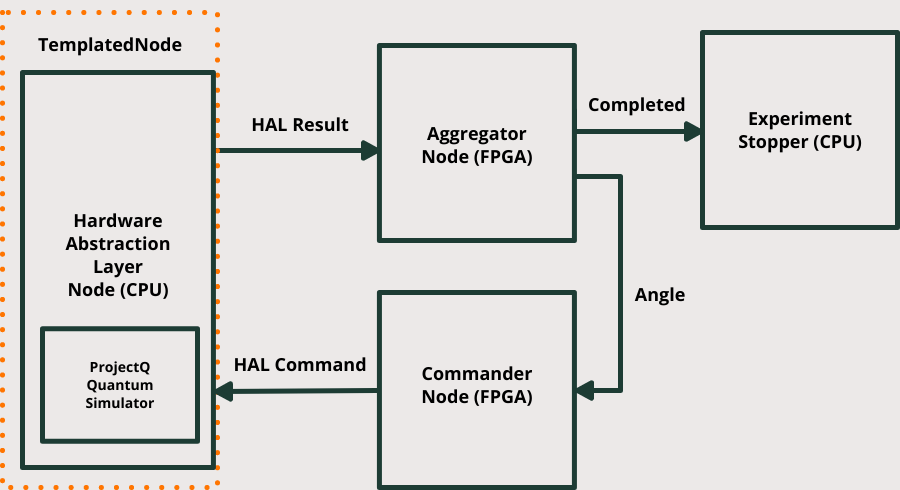

### Rabi Oscillation demos

We have selected a simple but powerful example of the capabilities of Deltaflow: a Rabi Oscillation (with a twist). The idea is simple: the user sends a sequence of gates (mainly rotation of variable phase over the same dimension) and operations via an Hardware Abstraction Layer and the control stack maps this requests into low-level control. To spice things up we added a low-latency feedback loop control on the angle that is generated. Measurements from the experiment drive the selection of the next sequence of rotations to be applied - all via FPGA logic. 

#### Description of the logic

The graph that follows describes the experiment. An Aggregator node receives the measurement from the control stack and applies a customizable selection criteria to the input to generate the next rotation angle. Commander node takes the sequence and prepares the HAL commands to be sent to the quantum control stack. The HAL guarantees that different control stacks can be connected to the graph in an interchangeable fashion. The ReadoutGen block runs [ProjectQ](https://projectq.ch) to emulate the behaviour of the quantum system. In the next demos, this block will evolve into a full-fledged emulator that shows the timing behaviour of a real quantum control stack!
 



### Deltaflow Graph  

To run the demo:
```console
river@lane:~$ cd deltaflow-on-artiq
river@lane:~/deltaflow-on-artiq$ make run-deltagraph

```

Structure of the demo:
- `deltalanguage` -> this repo contains the core language used by Deltaflow <br>
- `deltalanguage/examples/rabi_demo/` -> this folder contains the graph definition and the nodes for the graph.<br>
- - `demos/deltalanguage/Makefile` -> Make targets definitions<br>

### Deltaflow Simulator

To run the demo:
```console
river@lane:~$ cd deltaflow-on-artiq
river@lane:~/deltaflow-on-artiq$ make run-deltaruntime

```

This demo shows the conversion of a Deltagraph (python and migen nodes) into SystemC runtime. 
Main components of the demo are: 
- `deltasimulator` -> library required for converting Deltagraph into an hardware runnable implementation<br>
- `deltalanguage/examples/rabi_demo/` -> this folder contains the graph definition and the nodes for the graph.<br>
- `demos/deltasimulator/Makefile` -> library required for converting a Deltagraph into an hardware runnable implementation (currently SystemC)<br>
- `demos/deltasimulator/main.py` -> Script that calls the build commands on the different nodes<br>
- `demos/deltasimulator/df_module.*` -> Manual (and temporary) wiring of the systemC deltanodes <br>
- `demos/deltasimulator/run_experiment.cpp` -> Manual (and temporary) of all the nodes in a top_level block <br>

Artifacts:
`rabi_test.vcd` that can be visualized with [gtkwave](http://gtkwave.sourceforge.net)

### ARTIQ Emulator + Runtime

To run the demo:
```console
river@lane:~$ cd deltaflow-on-artiq 
river@lane:~/deltaflow-on-artiq$ make run-kasli-emulator
```
