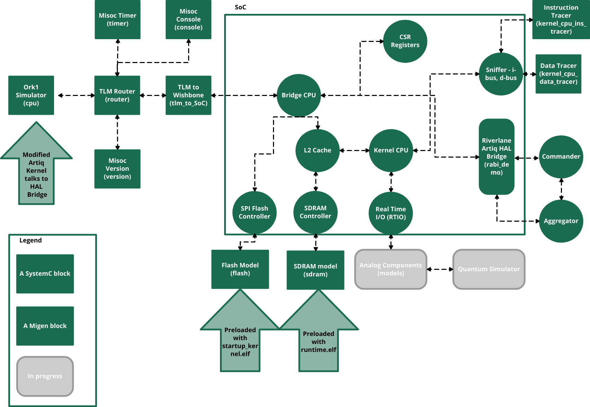

ARTIQ Emulator
==============

To test our Rabi-Demo in a realistic scenario we have developed a skeleton ARTIQ Emulator. 
We have started with a real simple implementation of it, slowly adding more features to make it
better emulate the real ARTIQ system. 

Our goal was to emulate the gateware as well as the firmware, gaining insights on how the two work
together to enable a quantum control stack. In particular, we were keen to follow the data from the 
top of the control stack, down to the digital control ports. 

We have made the following simplifications to make it simpler to understand and maintain:

* We are emulating a single FPGA configuration, with currently no support for the host PC. For the existing ARTIQ-user, 
  this means that we can't write (yet) kernels that use Remote Call Procedures (RCPs)

* We have added backdoor(s) to the various memories to accelerate the reading from external memories. 
  This means that the amount of time it takes in real life to load your applications will differ from 
  the timestamps you see in simulation. As we only use them for real long booting steps but not for 
  general L2 caching operations this won't change the "distance" between two I/O signals.

* We have frozen our ARTIQ environment to a specific version (in the Nix packages as well) to simplify our
  maintanance

* We have currently implemented only a Or1K-based configuration. This mainly because we found a really powerful 
  simulator of the Or1k instruction set `Ork1sim <https://github.com/openrisc/or1ksim>`_, making our emulator much faster to run.

How is the Emulator built?
--------------------------

1. Following the standard ARTIQ approach, a platform (*virtualKasli*) is defined in migen. Refer to :doc:`socbuilder` for more information. 

2. The Migen toolchain generates two types of outputs, gateware and software. We used them in the following ways:

    (A) :code:`build/artiq_kasli/gateware` contains all the gateware information (i.e. everything needed for synthetizing the design on FPGA). The emulator converts :code:`top.v` into a SystemC representation for later usage. 
  
    (B) The software instead is generated by compiling the standard ARTIQ firmware (contained in :code:`emulator/artiq/artiq/firmware`) via the Rust toolchain. The toolchain has compile flags in the form of :code:`#[cfg(has_x)]` that can be used to selectively compile portions of the code. Those values are derived from the migen representation and passed to the compiler via :code:`build/artiq_kasli/software/include/generated/rust-cfg`. 
   
    (C) Finally, the information contained in :code:`build/artiq_kasli/software/include/generated/csr.rs` and :code:`build/artiq_kasli/software/include/generated/mem.rs` are used to generate custom firmware. Their equivalent :code:`.h` versions are also referreed in :code:`emulator/artiq_emulator.hpp` in order to guarantee the correct propagation of general registers/address map definitions.

3. The rust compilation produces four outputs (i.e. that are used in the emulator). 

    (A) :code:`build/artiq_kasli/software/bootloader/bootloader.elf`. This file contains the bootloader code that the main cpu uses at time zero to perform the startup actions. The associated code has been optimized for the emulator. :code:`#[cfg(has_emulator)]` compiler directives have been used to speed-up/ignore hardware specific phases (e.g. DDR initialization)

    (B) :code:`build/artiq_kasli/software/runtime/runtime.bin`. This file contains the proper run-time image. This is loaded by the bootloader (Note: the full artiq system allows boot from network). This image is normally stored in flash memory and passed to DDR memory (after CRC-checks) where it will reside. In the emulator we are skipping this phase and loading it directly in DDR memory at time zero (the bootloader does not uses the DDR memory in our implementation). The Rabi-demo is currently embedded in the rust code and executed as part of the runtime sequence. 

    (C) :code:`build/startup_kernel.elf`. This image contains a simple experiment that uses the artiq-deltaflow interface to parse deltagraph requests (HAL commands) and pass them to the RTIO. This image is generated by the ARTIQ toolchain starting from **SoCBuilder/startup_kernel.py** and compiled into the correspondent elf file via the ARTIQ command :code:`artiq_compile.py`. Within the runtime sequence, the main CPU copies this image from the flash memory, copies in DDR (and/or l2 cache) and performs a dynamic relocation of its content to produce the correct execution trace. The Kernel CPU that has been sitting idle, is not enabled and it will start fetching instructions from the memory location (DDR) in which the startup_kernel has been loaded. 

    (D) :code:`build/idle_kernel.elf`. Similarly to the startup_kernel this file is generated from :code:`emulator/SoCBuilder/idle_kernel.py` and executed if there is no active network connection at the end of the sequence.

4. The :code:`top.v` generated at point 2. is converted into a SystemC representation via verilator `Verilator <https://github.com/verilator/verilator>`_. This conversion preserves the "hardware" nature of the verilog constructs, preserving clocks, parallel execution etc. Compared to a traditional "FPGA-simulation" there is a visible speed-up in terms of execution time.

5. The :code:`emulator/deltaflow_emulator.cpp` is the top-level of the SystemC run. It contains the verilated :code:`top.v` (that becomes code:`SoC.cpp`), the SystemC representation of the Rabi-demo Deltagraph and all the models and libraries required to mimick all the peripherals connected to the real ARTIQ system (defined in |Deltamodels|_ and :doc:`misoc_models`) 

6. The :code:`emulator/quantum_interface.hpp` defines a basic implementation of a conversion from single-bits control to a quantum command. In this implementation it deserializes the quantum command (received from a TTLOutput) into a format that a quantum simulator can digest.

.. |Deltamodels| replace:: **Deltamodels**
.. _Deltamodels: https://riverlane.github.io/deltamodels

.. toctree::
  :maxdepth: 2
  :caption: Contents
  :hidden:

  socbuilder
  misoc_models

