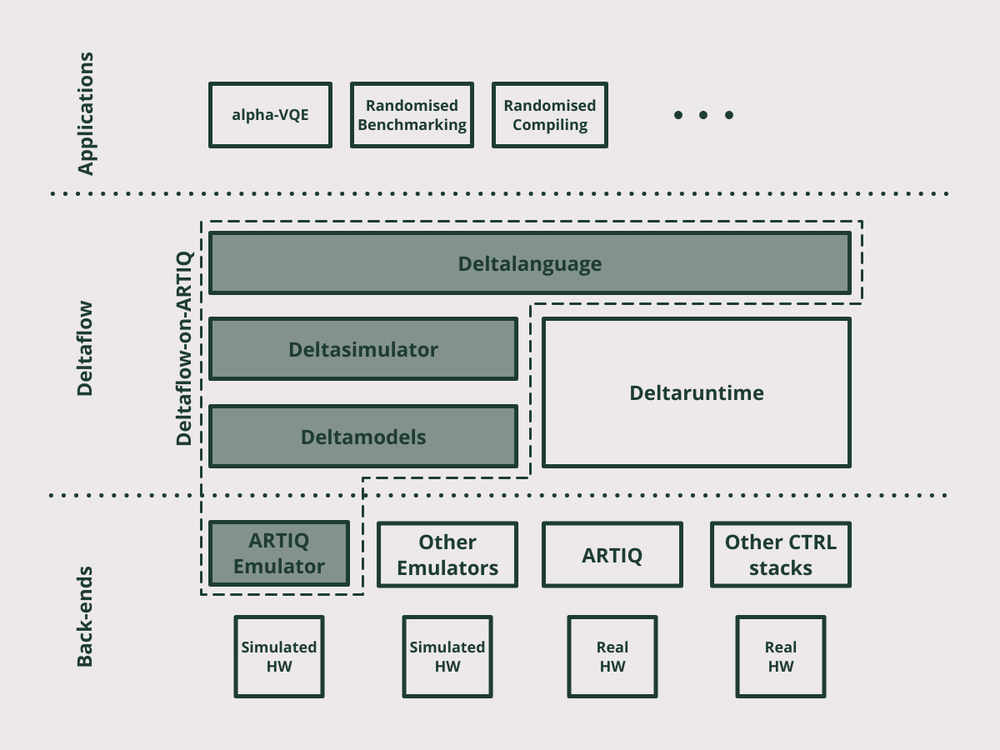

.. title:: Overview

Deltaflow-on-ARTIQ documentation
================================

`GitHub Repo <https://github.com/riverlane/deltaflow-on-artiq>`_ | 
`Official Deltaflow Discord <https://discord.gg/Gd2bYKvAeW>`_ |
`Riverlane Website <https://www.riverlane.com>`_

------------

.. toctree::
  :maxdepth: 2
  :caption: Contents
  :hidden:

  intro
  install
  examples
  artiq_emulator
  hardware_abstraction_layer
  faq
  licenses

Welcome to the documentation for Deltaflow-on-ARTIQ.
If you use Deltaflow, we would be ever so thankful if you could give
us some feedback via a few minute
`survey <https://amyflower.typeform.com/to/LnovZGSj>`_.

What is Deltaflow and Deltaflow-on-ARTIQ?
-----------------------------------------

|Deltaflow| sees the quantum computer as a distributed control system with
CPUs, FPGAs, analogue units, and qubits working under tight latency
constraints.
The Deltaflow language lets the user to define a graph of nodes representing
the different elements of computation and interconnect them.
The Deltaflow simulator and runtime take care of mapping a Deltaflow graph
onto simulated or real hardware respectively.
A Deltaflow programme is portable across qubit technologies via a Hardware
Abstraction Layer, a minimal set of instructions through which a
Deltaflow programme controls hardware.

|Deltaflow-on-ARTIQ| is our first step towards achieving our vision of
Deltaflow.
It lets you write Deltaflow programmes, run them on a hardware simulator and
test them on an emulated backend of the popular |ARTIQ|_ control system.
You can find the corresponding github repo `here <https://github.com/riverlane/deltaflow-on-artiq>`_.

Please find below an architectual diagram that addresses all components
individually and provide their relations:

* |Deltalanguage|_ (The Deltaflow language) allows users to specify
  compute nodes and data channels facilitating communications.
  It’s a hosted domain-specific language based on Python: the nodes are
  filled with code corresponding to the hardware that is represented
  (currently Python for CPU nodes, Migen for FPGA nodes).

* |Deltasimulator|_ (The Deltaflow simulator) is a
  tool for running Deltaflow programs on *simulated* hardware.

* |Deltamodels|_ (The Deltaflow models) provides infrastructure for
  bridging |Deltasimulator|_ with simulated hardware.

* **Deltaruntime** (The Deltaflow runtime) is a
  tool for running Deltaflow programs on *real* hardware.
  It will be added in the future releases of Deltaflow.

* **Back-ends** are specific real-time data acquisition frameworks that
  facilitate interaction of hardware at the lowest level.

* Various **applications** are portable on Deltaflow and are provided in
  this release for illustration purposes.

How can I get started?
----------------------

We recomment to follow these steps:

- Please read our :doc:`intro` to understand better why we are building
  Deltaflow, how it can help you, and how you can use it.

- Get familiar with |Deltalanguage|_ by following its manual. The main steps
  include:

  - Going through the interactive tutorials which are aimed on
    fresh users.

  - [Optional] Afterwards you can get a flavour of more serious algorithms
    by working through some of the examples.

- [Optional] Get familiar with |Deltasimulator|_ and |Deltamodels|_ by
  following their manuals.
  At the moment they do not provide in-depth information and meant to be
  explained later.

- Go through :doc:`examples` to learn about Deltaflow-on-ARTIQ by doing
  the same Rabi Oscillations Demo in 3 different ways:

  - Via debugging toolchain of Deltalanguage

  - Via Deltasimulator

  - Via the ARTIQ Emulator backend
    
  If you are interested in using Deltaflow for experimental control, look at
  our micromotion and sine wave generation
  `examples <https://riverlane.github.io/deltalanguage_internal/dev/examples/examples.html>`_.

About this release
------------------

This release constitutes **Deltaflow-on-ARTIQ v0.3.0** with the following
components:

+--------------------+-----------+
| Component          | Version   |
+====================+===========+
| |Deltalanguage|_   | v0.3.0    |
+--------------------+-----------+
| |Deltasimulator|_  | v0.3.0    |
+--------------------+-----------+
| |Deltamodels|_     | v0.3.2    |
+--------------------+-----------+

.. TODO:: Automate this version extraction from the packages.

.. TODO:: For the public release, refer to the stable versions.

.. Links

.. |Deltalanguage| replace:: **Deltalanguage**
.. _Deltalanguage: https://riverlane.github.io/deltalanguage

.. |Deltasimulator| replace:: **Deltasimulator**
.. _Deltasimulator: https://riverlane.github.io/deltasimulator

.. |Deltamodels| replace:: **Deltamodels**
.. _Deltamodels: https://riverlane.github.io/deltamodels

.. |ARTIQ| replace:: ARTIQ
.. _ARTIQ: https://m-labs.hk/experiment-control/artiq

.. |Deltaflow| replace:: **Deltaflow**

.. |Deltaflow-on-ARTIQ| replace:: **Deltaflow-on-ARTIQ**
