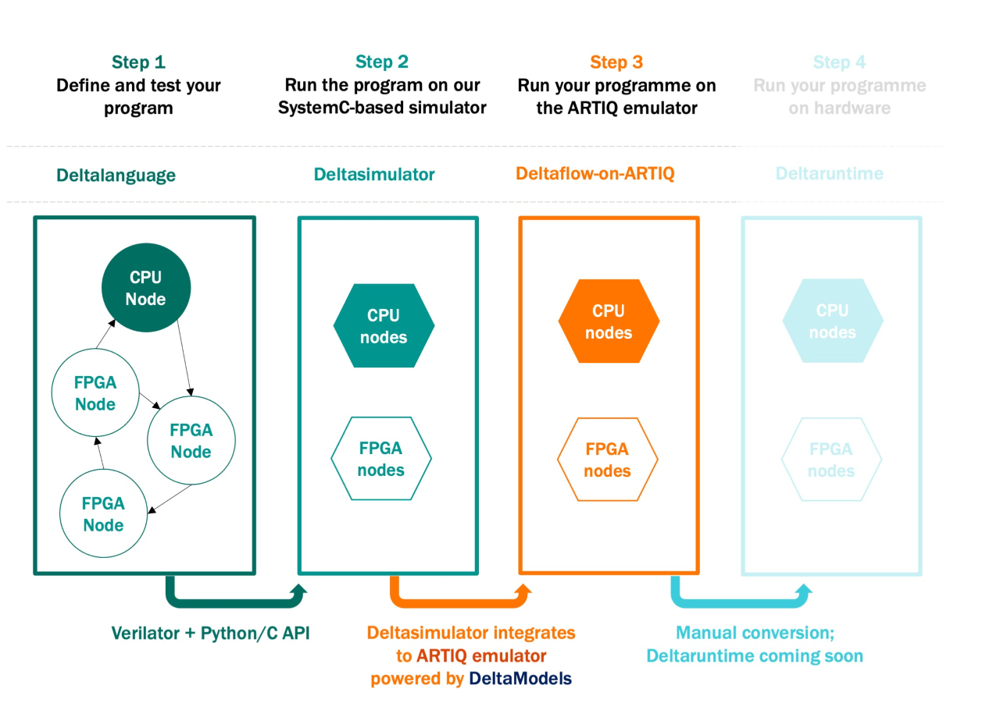

Introduction
============

Why are we building Deltaflow?
------------------------------

In short there are four main reasons:

* Many algorithms are difficult to implement without access to local control,
  which is mostly afforded by FPGAs in quantum computers (see also
  `our white paper <https://arxiv.org/abs/2009.08513>`_).
  Deltaflow gives the programmer access to local control, lets them implement
  these algorithms on a real device.

* We want to create an easier, more professional way of working with FPGAs
  in your lab.
  Deltaflow is python-based and lets you string together FPGA and CPU
  programmes with ease.

* We want to make it easier for people working with FPGAs in the lab to
  verify and debug their device.
  This is why we have built an emulator of the ARTIQ control system.

* We want to create a shared language for control stack developers and
  algorithms/applications developers.
  Deltaflow allows hardware developers to programme experimental protocols
  and software developers to implement high-level algorithms.

A longer answer:

Languages that treat the quantum computer as a self-managing resource are
not useful for the NISQ era of quantum computing.
Instead, users often want to define their own methods to control the
quantum computer.
As an example, this could be for the purpose of defining a new measurement
error mitigation technique.
Reconfigurable logic systems are the obvious near-term solution for
low latency and customisable control of a quantum device.

This then leads to quantum computing architecture with two discrete parts;
the hardware level language to convert given gates to pulses
(yellow and red boxes below) and the high-level expression language
for a user to define their quantum algorithms (CPU orange box).
The Deltaflow project aims to unify control of these two sub-systems,
such that a user needs only produce one program to control the
entire quantum computing stack.

* **Orange** - CPU, slow time scales, general lab control.
  100us

* **Yellow** - FPGAs handling the experiment.
  100us

* **Red** - Fast FPGA layer.
  (Ions: 100us, SC: 1us, Silicon: 10-100ns)

* **Purple** - Qubit controlling hardware.
  (Ions: 100us, SC: 1us, Silicon: 10-100ns)

* **Turquoise** - Quantum system.
  (Ions: 100us, SC: 100ns, Silicon: 10-100ns) 

Whilst there are several different qubit technologies
(ions, silicon, superconducting, photons...) the surrounding control
hardware all share a similarity.
This allows us to define a dummy control stack that abstractly covers
most systems, albeit with varying constraints on latency.
Starting with a high-level CPU and working it’s way down through FPGA
layers until we get to the hardware controlling the quantum system. 

Dataflow programming allows us to program across this stack.
In this paradigm, different nodes represent operations and directed
edges between nodes represent the flow of data.
In this flexible model, a node could contain a block of code from
any programming language, as long as a common interface is defined
for the transmission of data. 

A dataflow program for our dummy quantum hardware lab could look
something like above.
It consists of 6 nodes (circles), connected by edges.
The colour of each circle indicating where in the stack the node will live.

This allows a user to easily write high-level algorithms whilst also
giving access to low-level and time-critical parts of the system. 

Why should I care if ... ?
--------------------------

... I’m a quantum algorithm / application developer?
^^^^^^^^^^^^^^^^^^^^^^^^^^^^^^^^^^^^^^^^^^^^^^^^^^^^^^^

If you’re a quantum algorithm or app developer, you have probably come
across algorithms that are difficult to implement without access to local
control (usually provided by an FPGAs) in the quantum computer.
For example: 

- To implement `noise aware compiling <https://arxiv.org/abs/1901.11054>`_,
  `in-situ calibration <https://arxiv.org/abs/1907.03864>`_, or
  `accelerated VQE <https://journals.aps.org/prl/abstract/10.1103/PhysRevLett.122.140504>`_,
  we need to be able to react to the results of small batches of circuits

- To implement `holoVQE <https://arxiv.org/abs/2005.03023>`_,
  `QNN dropout <https://arxiv.org/abs/1911.00352>`_, or
  `simple error correction <https://arxiv.org/abs/1807.02467>`_, we need
  to react to the results of qubits measurements within a quantum circuit.

Deltaflow allows you to easily string together CPU nodes and FPGA nodes so
you can plan how to run these algorithms on real hardware.
The Deltaflow workflow allows you to run a programme in simulation, going
from a very simple python-based model to realistic hardware models (in this
first release it’s an emulator of the ARTIQ control system).
This means you can eliminate bugs offline before you even go to the lab.

... I’m an ARTIQ user?
^^^^^^^^^^^^^^^^^^^^^^

Here are all the things you can do with Deltaflow-on-ARTIQ:

- You can use Deltaflow to write experimental control protocols.
  We’ve written an example on micromotion compensation, which you can find in
  Examples.

- You can use the ARTIQ emulator we have built for offline testing and
  continuous integration.
  The Deltaflow-on-ARTIQ simulator includes a high-performance model of
  the Kasli controller.
  This lets you run ARTIQ kernels in an accurate emulator without taking
  time on the experiment, helping your physicists avoid timing errors and
  other runtime issues.
  (Please note that the ARTIQ emulator is no available as a stand-along item
  in this release, please contact us at deltaflow@riverlane.com if you
  wish to use it.)

- If you need to develop real time extensions to ARTIQ you can use Deltaflow
  to build portable and testable gateware.
  With Deltaflow, the control systems you develop can scale to use
  additional Kasli cards as you scale your experiment, and you can develop
  your extension to be portable with any Deltaflow-supporting collaborator.

... I’m a hardware developer not using ARTIQ?
^^^^^^^^^^^^^^^^^^^^^^^^^^^^^^^^^^^^^^^^^^^^^

The idea of Deltaflow and its associated emulators is to make writing and
testing experimental protocols easy.
For an example, please see our Micromotion and Sine Wave Generation Examples.

We are currently building a runtime that would allow you to run Deltaflow
programmes on your hardware device (after you have integrated).
Contact us at deltaflow@riverlane.com if you would like to chat about that,
we would love to hear from you. 

How does it work?
-----------------

At high level the Deltaflow programming can be split in the following steps:

Step 1: **Programming**
  The user defines and tests compute nodes and data channels
  between them; that constitutes a
  :py:class:`DeltaGraph` which is the 
  central element of the Deltaflow program.
  This stage is done using |Deltalanguage|_.

Step 2: **Simulating**
  The graph is handed over to the simulator that runs it on only on CPUs.
  This stage is done using |Deltasimulator|_.

Step 3: **Simulating on an emulator**
  In this stage the Deltaflow program is compiled to general-purpose
  languages (python, verilog) and simulated with models of the quantum
  computer and your control system.
  This gives you greater confidence in the correctness of your
  interfaces and the full system.
  This stage is done using |Deltasimulator|_, |Deltamodels|_, and
  ARTIQ Emulator.

Step 4: **Runtime**
  The graph is handed over to the runtime that runs it on real hardware
  including CPUs and FPGAs.
  This stage is done using Deltaruntime, which will be added in the future
  releases of Deltaflow.

In analogy with compilation process of C files, Deltaflow multi-step process
provides a number of benefits:

- Deltaflow programs are hardware agnostic, i.e. application developers work
  only at the programming stage, with little of none knowledge of
  hardware.

- Commercial drivers can be added by hardware providers after the graph is
  defined, i.e. sensitive information is not shared.

- Hardware providers have different runtime systems, however
  their interfaces are unified by the Hardware Abstraction Layer (HAL).

.. |Deltalanguage| replace:: **Deltalanguage**
.. _Deltalanguage: https://riverlane.github.io/deltalanguage

.. |Deltasimulator| replace:: **Deltasimulator**
.. _Deltasimulator: https://riverlane.github.io/deltasimulator

.. |Deltamodels| replace:: **Deltamodels**
.. _Deltamodels: https://riverlane.github.io/deltamodels
